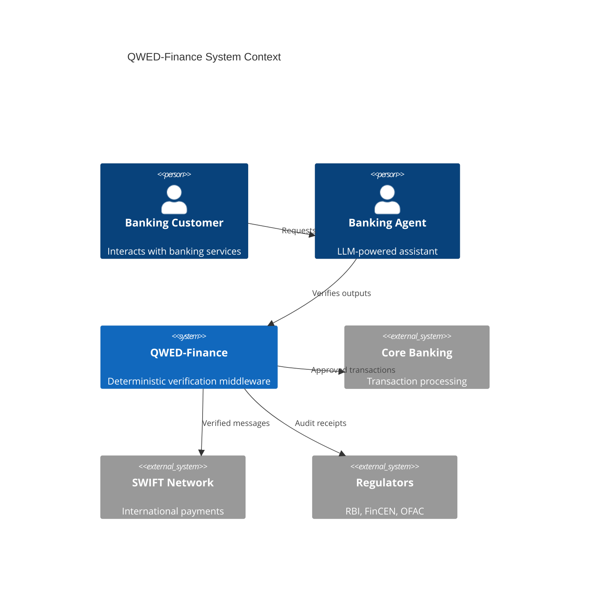
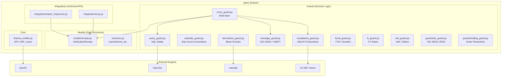
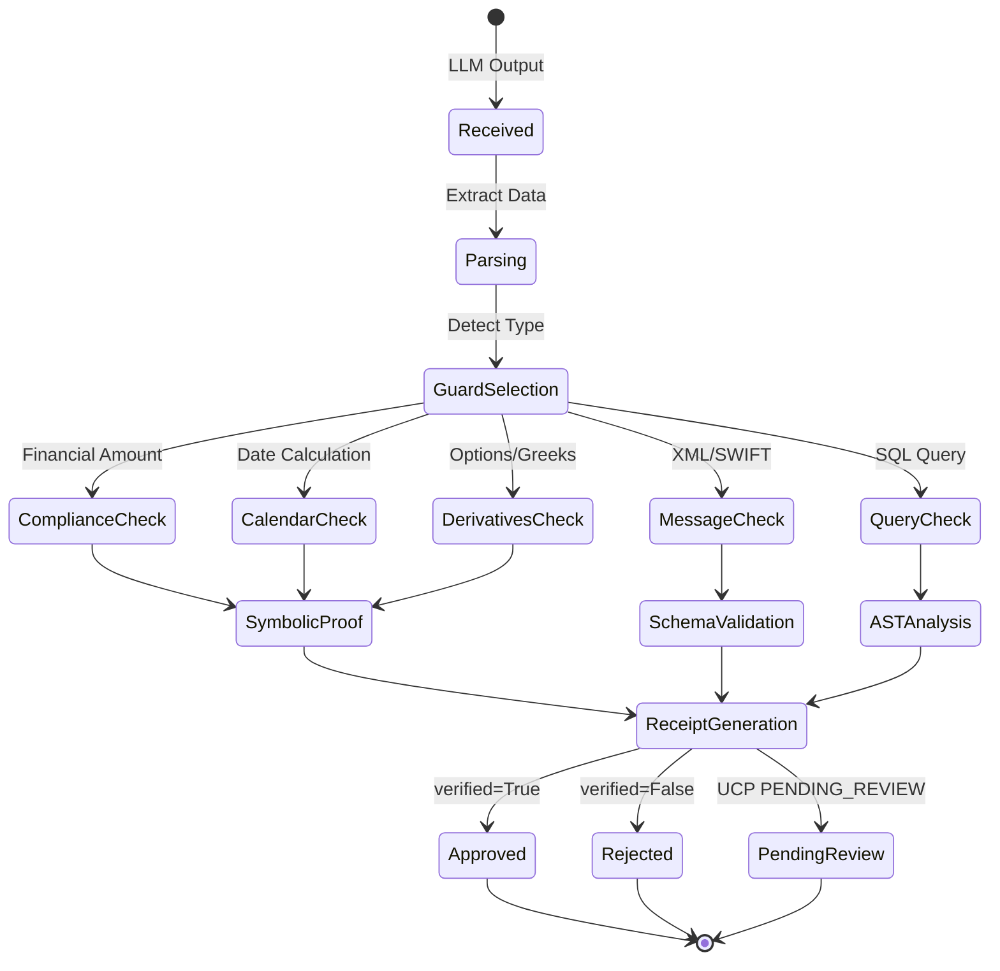
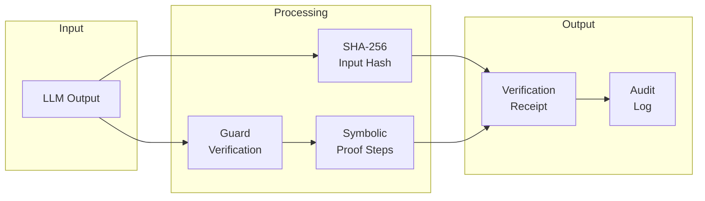
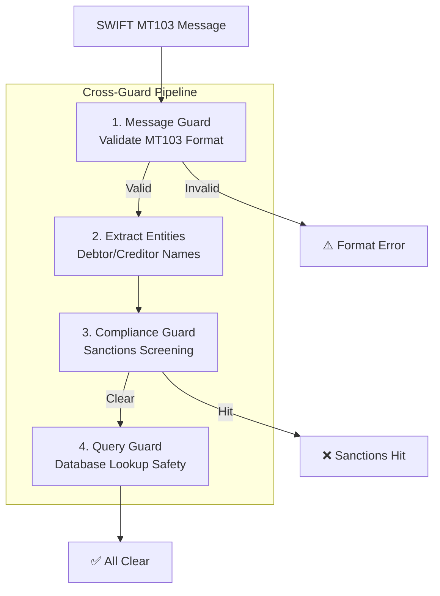
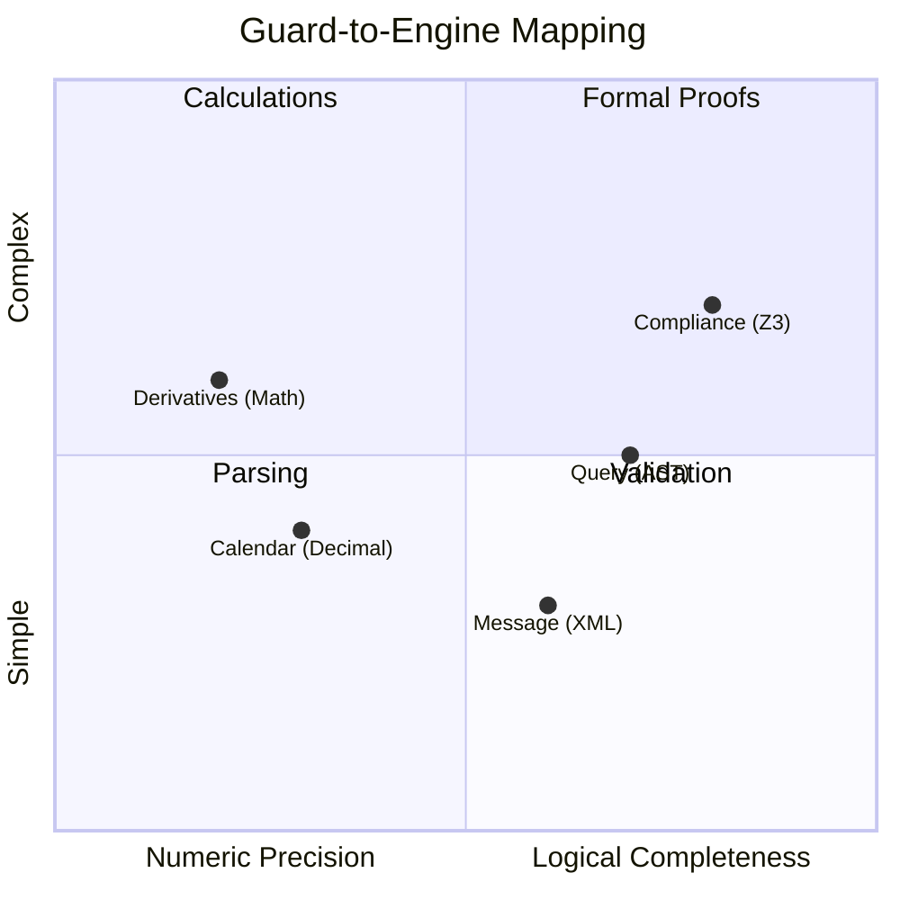
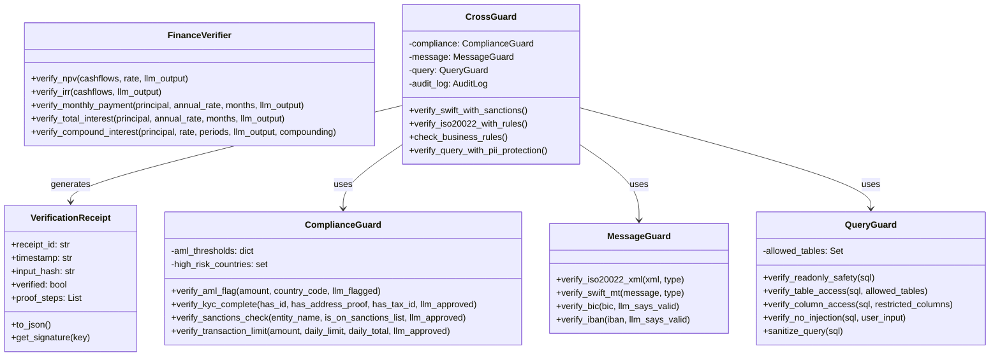
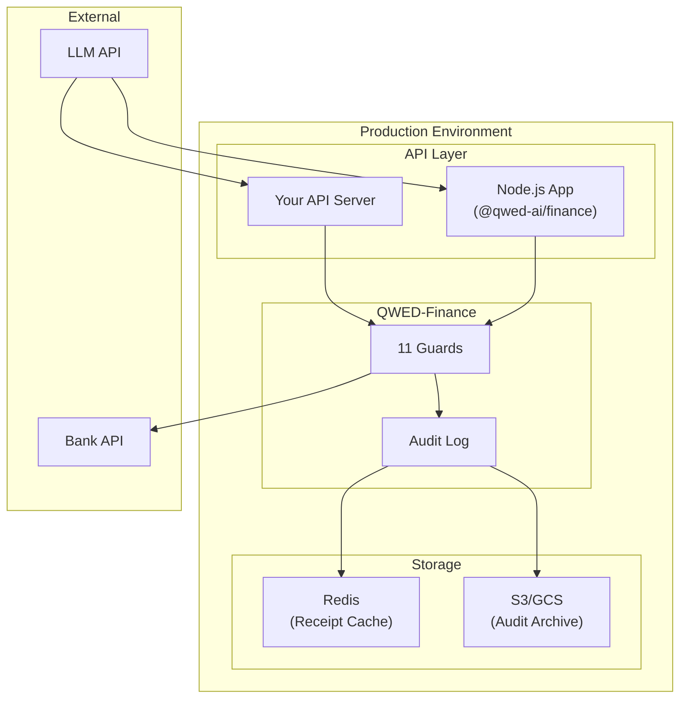

This page provides a deep dive into the internal design of QWED-Finance.

## System overview

## Guard architecture

### Component diagram

## Verification flow

### State machine

## Data flow

### Verification receipt lifecycle

### Cross-guard pipeline

## Engine selection matrix

## Class diagram

## Deployment architecture

---

## Design principles

### 1. Determinism first

Every verification produces the **same result** for the same input. No randomness.

### 2. Symbolic over statistical

Use solvers and exact arithmetic (Z3, SymPy, mpmath, `Decimal`) instead of probabilistic confidence scores.

### 3. Audit where it matters

`CrossGuard`, `UCPIntegration`, and the built-in `OpenResponsesIntegration` tools generate receipts automatically. Direct guard calls and custom Open Responses tools return result objects; create a receipt with `ReceiptGenerator` when you need an audit record. Invalid input fails closed instead of passing silently.

### 4. Defense in depth

Cross-Guard combines multiple guards for layered security.

---

## Related pages

- [Overview](/finance/overview) — Introduction and quick start
- [The 11 guards](/finance/guards) — Guard implementation details
- [Compliance & Auditing](/finance/compliance) — Receipt and audit log details